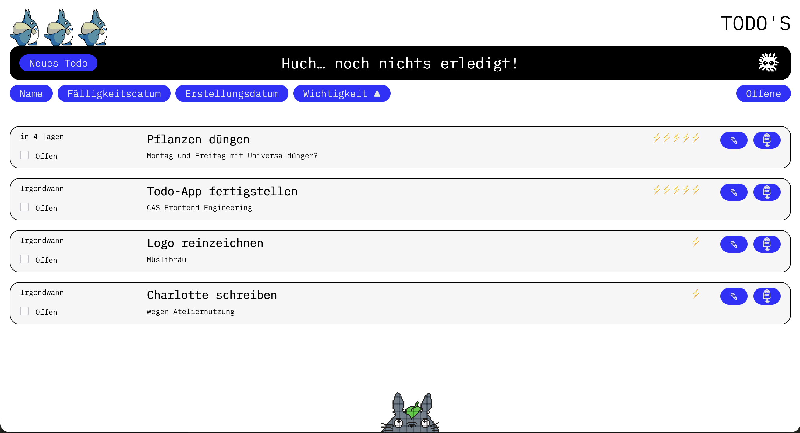
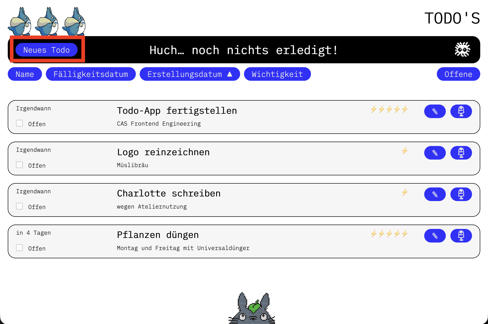
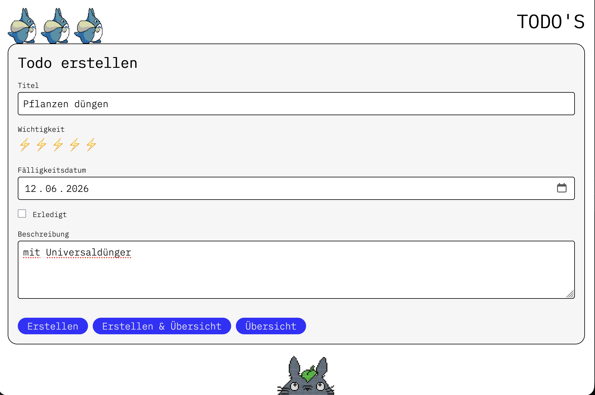
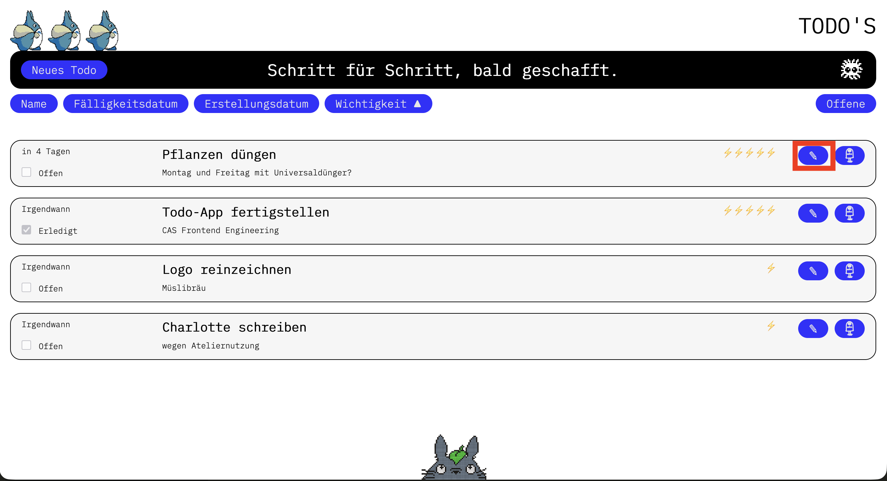
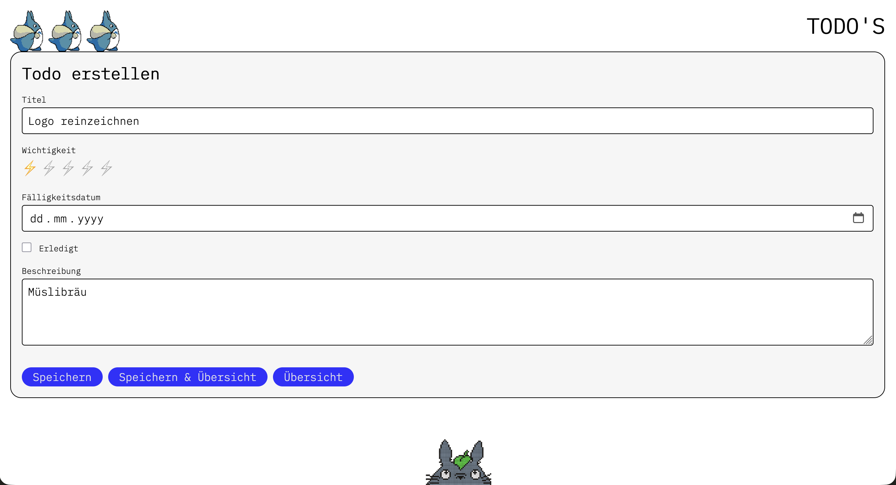
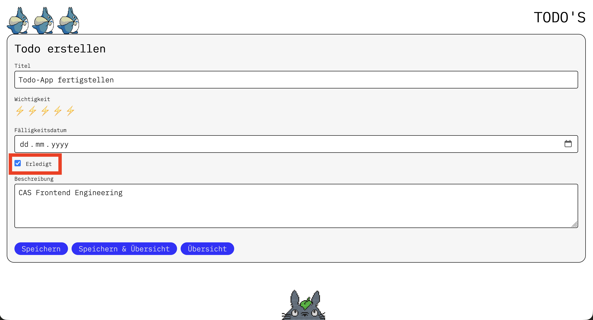
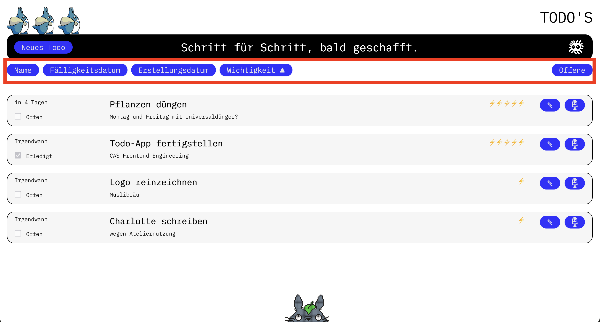
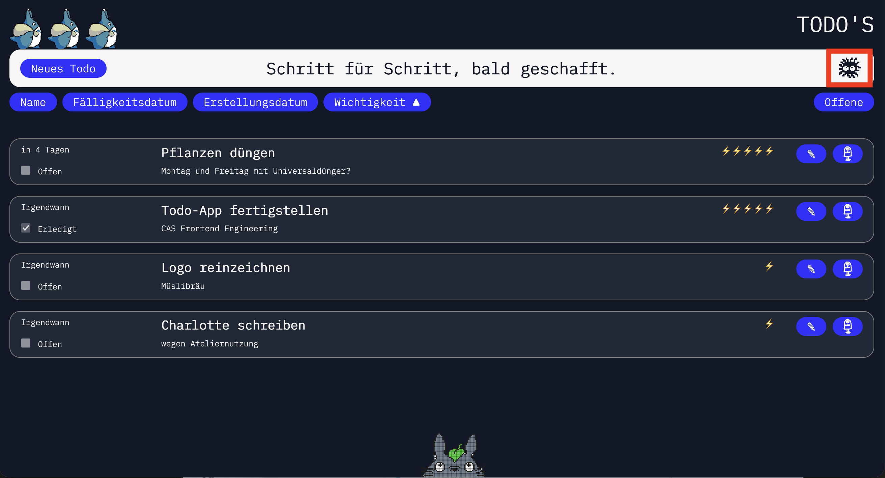

# CAS FEE Todo-App

## Abstract / Management Summary

Im Rahmen des CAS Frontend Engineering wurde eine Todo-Applikation entwickelt. Die Anwendung ermöglicht es, Aufgaben zu erstellen, zu bearbeiten und zu löschen. Jedes Todo kann mit einem Titel, einem Fälligkeitsdatum, einer Wichtigkeitsstufe und einer Beschreibung versehen werden. Die Todos werden über eine REST API in einer lokalen NeDB-Datenbank gespeichert. Die Oberfläche ist in Plain JavaScript nach dem MVC-Muster aufgebaut.



## Inhaltsverzeichnis

1. [Setup Guide](#1-setup-guide)
2. [How to Use](#2-how-to-use)
3. [How to Develop](#3-how-to-develop)
4. [Technologiekonzept](#4-technologiekonzept)
5. [Technische Dokumentation](#5-technische-dokumentation)

## 1. Setup Guide

### Installation

Repo klonen:

```
git clone https://github.com/MarisaMllr/FEE_projekt_01.git
```

NPM-Pakete installieren:

> **Info:** Node.js muss für den folgenden Befehl installiert sein.

```
npm install
```

Umgebungsvariablen einrichten:

```
cp code/.env.example code/.env
```

### Nutzung

#### Produktionsmodus

```
npm start
```

#### Dev-Modus (mit automatischem Reload)

```
npm run start:watch
```

Die Applikation ist anschliessend unter [http://127.0.0.1:8080](http://127.0.0.1:8080) erreichbar (oder dem in `.env` konfigurierten Port).

### Umgebungsvariablen

| Variable   | Standard    | Beschreibung                 |
| ---------- | ----------- | ---------------------------- |
| `HOSTNAME` | `127.0.0.1` | Hostname des Servers         |
| `PORT`     | `8080`      | Port des Servers             |
| `DB_NAME`  | `todos.db`  | Dateiname der NeDB-Datenbank |

> **Hinweis:** Die Datenbankdatei wird beim ersten Start automatisch unter `code/data/<DB_NAME>` erstellt. Um die Daten zurückzusetzen, genügt es, diese Datei zu löschen.

---

## 2. How to Use

### Todo erstellen

Oben links den «Neues Todo»-Button klicken. Im Dialog Titel (Pflichtfeld), Fälligkeitsdatum, Wichtigkeit und Beschreibung eingeben und speichern.

<table>
  <tr>
    <td></td>
    <td></td>
  </tr>
</table>

---

### Todo bearbeiten

Auf das Bearbeiten-Icon eines Todos klicken. Der Dialog öffnet sich mit den bestehenden Werten vorausgefüllt. Nach dem Anpassen speichern.

<table>
  <tr>
    <td></td>
    <td></td>
  </tr>
</table>

---

### Todo löschen

Auf das Löschen-Icon eines Todos klicken.

> **Achtung:** Eine Löschung ist permanent und kann nicht rückgängig gemacht werden.


---

### Als erledigt markieren

Auf das Bearbeiten-Icon eines Todos klicken. Der Dialog öffnet sich. Die Checkbox anklicken, um ein Todo als erledigt zu markieren oder die Markierung aufzuheben.



---

### Filtern und Sortieren

Mit dem Filter-Button lassen sich erledigte Todos ausblenden. Die Sortier-Buttons sortieren die Liste nach dem gewählten Kriterium – ein erneuter Klick kehrt die Reihenfolge um. Die aktive Sortierung wird im Browser gespeichert.



---

### Dark / Light Theme

Den Theme-Button oben rechts anklicken, um zwischen hellem und dunklem Design zu wechseln.



---

## 3. How to Develop

### Server

Der gesamte Server-Code liegt im Ordner [code/server/](code/server/). Der Server liefert beim Aufruf von `/` automatisch die statischen Frontend-Dateien aus – es wird kein separater Dev-Server benötigt.

```
npm run start:watch
```

### Client

Alle Client-Dateien liegen in [code/public/](code/public/). Das Frontend kommuniziert über die REST API unter `/api/todos` mit dem Server.

---

## 4. Technologiekonzept

**[Node.js](https://nodejs.org/)**\
Laufzeitumgebung für den Server und für die Verwaltung der NPM-Pakete.

**[Express.js](https://expressjs.com/) (v5)**\
Express wird als Web-Framework für den Server eingesetzt. Es stellt die REST API zur Verfügung und liefert die statischen Frontend-Dateien aus.

**[NeDB](https://github.com/seald-io/nedb)**\
NeDB ist eine dateibasierte Datenbank im MongoDB-Stil, die ohne separaten Datenbankserver auskommt. Die Todos werden in einer lokalen `.db`-Datei gespeichert.

**Vanilla JavaScript (ES Modules)**\
Das Frontend ist in Plain JavaScript nach dem MVC-Muster aufgebaut – ohne Frameworks. ES Modules werden direkt im Browser verwendet.

**[Prettier](https://prettier.io/) / [ESLint](https://eslint.org/)**\
Für eine einheitliche Code-Formatierung wird Prettier, für statische Codeanalyse ESLint eingesetzt.

---

## 5. Technische Dokumentation

### 5.1. Architektur

Die Applikation ist nach dem **MVC-Muster** strukturiert:

```
Frontend (Browser)               Backend (Node.js / Express)
──────────────────────────────   ──────────────────────────────
controllers/                     routes/
  ├─ TodoController                 └─ TodoRouter
  └─ ThemeController             controllers/
models/                             └─ TodoController (server)
  └─ Todo                        services/
services/                           └─ TodoService (server)  ──►  NeDB (todos.db)
  ├─ TodoService  ─────────────►  REST API /api/todos
  ├─ FilterService
  └─ ThemeService
views/
  ├─ TodoListView
  ├─ TodoView
  ├─ TodoDialogView
  └─ ThemeView
```

---

### 5.2. REST API

Alle Endpunkte sind unter `/api/todos` verfügbar.

| Methode  | Endpunkt         | Beschreibung             |
| -------- | ---------------- | ------------------------ |
| `GET`    | `/api/todos`     | Alle Todos laden         |
| `GET`    | `/api/todos/:id` | Einzelnes Todo laden     |
| `POST`   | `/api/todos`     | Neues Todo erstellen     |
| `PUT`    | `/api/todos/:id` | Bestehendes Todo updaten |
| `DELETE` | `/api/todos/:id` | Todo löschen             |

---

### 5.3. Todo-Datenmodell

```js
{
  title:       String,   // Pflichtfeld
  dateDue:     Date,
  importance:  Number,
  description: String,
  completed:   Boolean,
  dateCreated: Date      // wird automatisch gesetzt
}
```

---

### 5.4. FilterService

Der `FilterService` ist eine statische Hilfsklasse im Frontend und übernimmt das Filtern und Sortieren der Todos, bevor sie gerendert werden.

`FilterService.filterIncomplete(todos)` — gibt nur Todos zurück, bei denen `completed === false`.

`FilterService.sort(todos, key, direction)` — sortiert nach einem beliebigen Feld. Datum-Felder werden als `Date`-Objekt verglichen, numerische Felder numerisch, alle anderen alphabetisch. Die Sortierrichtung `direction` ist `1` (aufsteigend) oder `-1` (absteigend).

---
